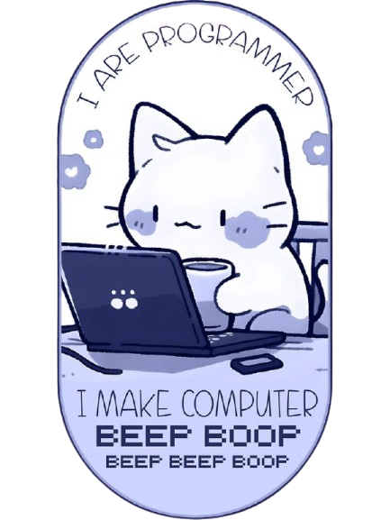

<!--
**adwltfh/adwltfh** is a ✨ _special_ ✨ repository because its `README.md` (this file) appears on your GitHub profile.

Here are some ideas to get you started:

- 🔭 I’m currently working on ...
- 🌱 I’m currently learning ...
- 👯 I’m looking to collaborate on ...
- 🤔 I’m looking for help with ...
- 💬 Ask me about ...
- 📫 How to reach me: ...
- 😄 Pronouns: ...
- ⚡ Fun fact: ...
-->
<!-- header -->
<p align="center">
  
</p>

<h2 align="left"> 👨🏻‍💻 &nbsp;A Little Bit About Me and My Interests</h2>

<table align="center" border="0">
<tr>
<td width="50%" valign="top">
  
```yaml
name: Adawiyyah Latifah
located_in: South Jakarta, Indonesia
current_job: Frontend Developer
education:
  [
    "Bachelor's in Informatics Engineering",
    "Full Stack Data Analytics",
  ]
company: PT Integra Solusi Mandiri (2 YoE)
fields_of_interests:
  [
    "Web Development",
    "Data Analytics",
    "Big Data",
    "SQL",
    "Machine Learning",
    "UI/UX",
  ]
technical_background:
  [
    "Full Stack Developer",
    "DevOps Solutions Architect",
    "Intern - Data Science & Machine Learning in Python",
    "Intern - Internet Of Things",
    "Intern - VLSI and FPGA Implementation",
  ]
  
currently_learning: ["SEO Optimation, MongoDB, Python (Backend)"]
2026 Goals: ["Enhance frontend skills, learning new techs, create 10+ projects."]
hobbies: ["Gaming", "Art", "Reading"]
```

</td>
<td width="50%" align="center">
  
</td>
</tr>
</table>

---

<h2 align="left"> 🔗 &nbsp;Let's Connect and Have a Chat!</h2>
<p align="left">
<a href="https://-.netlify.app/">
  
</a>
<a href="https://www.linkedin.com/in/adawiyyahlatifah/">
  
</a>
<a href="https://adawiyyahlatifah.medium.com/">
  
</a>
</p>

